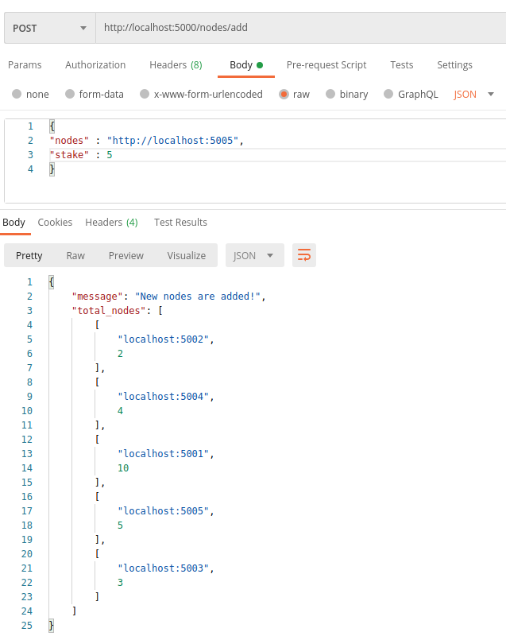
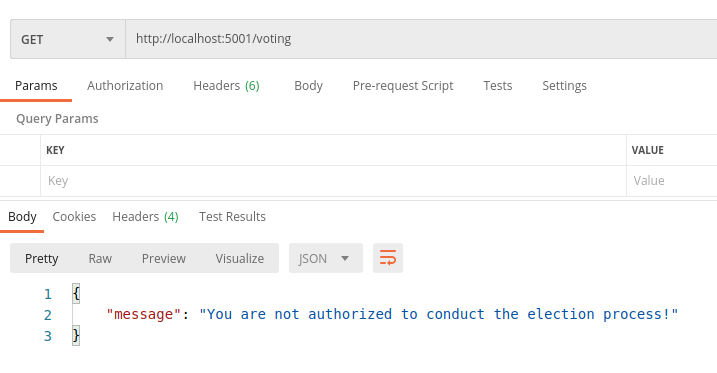
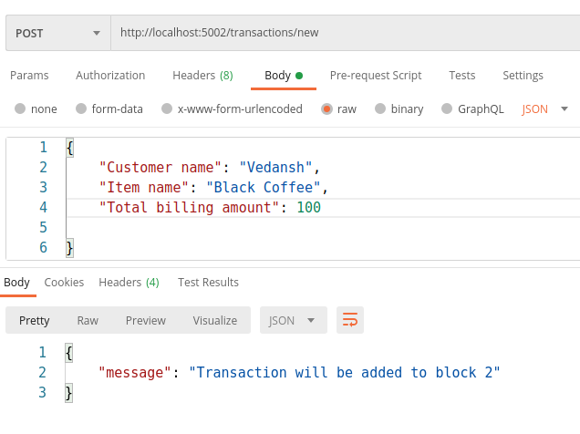
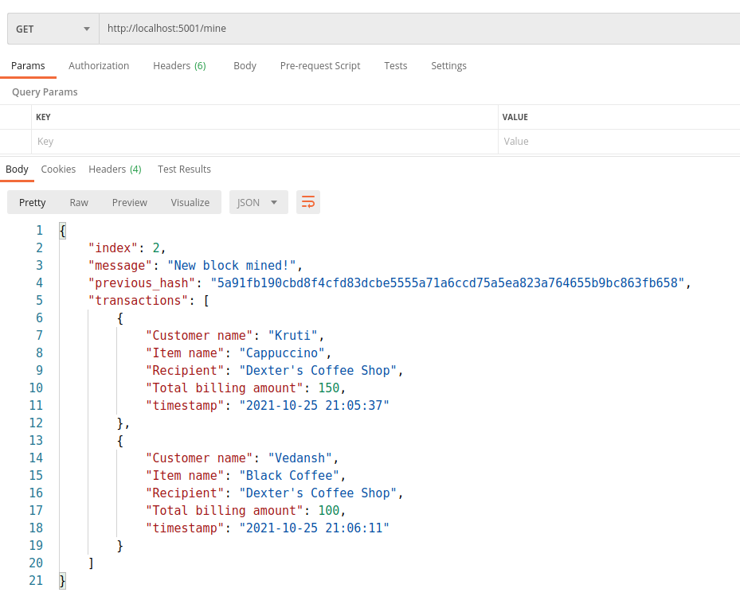

# Blockchain Assignment - 2

## Team members - (Group 15)
1) [Baraiya Kruti Harshadkumar](https://github.com/krutibaraiya) (2019A7PS1260H)
2) [Vedansh Srivastava](https://github.com/vedansh-srivastava) (2019A7PS0323H)
3) [Umang Agarwal](https://github.com/UmangAgarwal17) (2019A7PS0185H)

## Objective
* This assignment is in continuation to our previous assignment where we had implemented a simple multi-node Blockchain for Dexter's coffee shop in Python-Flask.
* This assignment focuses on implementing the consensus algorithm - __Delegated Proof of Stake__ for Dexter's Blockchain.

## Delegated Proof of Stake (DPoS) algorithm 
DPoS is a reliable, robust, scalable and efficient consensus algorithm in Blockchain technology. It is an innovation over standard Proof of Stake (PoS). In DPoS, each node that has a stake in the system can delegate the validation of a transaction to other nodes by voting.

Here, in DPoS ,user's vote weight is proportional to their stake rather than block mining being tied to the stakeholders' total tokens.

## Implementation of DPoS in Dexter's Blockchain
* All the methods are properly defined in Blockchain class of `blockchain.py` and the API routes to interact with the blockchain in `main.py`

### Methods in `blockchain.py`

* We have made `localhost:5000` as a primary node which takes care of adding new nodes to the network, maintain the stakes of those nodes , conduct the election process and choosing __3 delegate (validator) nodes__ which are authorised to validate transactions mine new blocks.

* We can add as many nodes as we want to the network using the `nodes/add` API endpoint, but only 3 nodes will be selected as validator (delegate) nodes after the voting process.

* Here, for the purpose of simulation of voting process, our algorithm assigns random integers between 0 and 100 as votes using python's randint() function.
    * Snippet of voting method of Blockchain class implemented in `blockchain.py`
    ```
    def add_vote(self):
        self.all_nodes = list(self.nodes)
        for x in self.all_nodes:
            y=list(x)
            y.append(x[1] * randint(0,100))
            self.voteNodespool.append(y)
 
    ```
* The 3 delegates are chosen from the pool of all stakeholders based on their stakes and votes received, i.e. the top 3 nodes having highest value of `(stake x votes)` are chosen to be the delegates.
    * Snippet of the delegated selection implemented in Blockchain class in `blockchain.py`
    ```
    def selection(self):
        self.starNodespool = sorted(self.voteNodespool, key = lambda vote: vote[2],reverse = True)
        for x in range(3):
            self.superNodespool.append(self.starNodespool[x])
        for y in self.superNodespool:
            self.delegates.append(y[0])
    ```

* The primary node (localhost:5000) generates the delegate list and all other nodes can view the elected delegates. For this we have a sync().
    * Snippet of sync method implemented in Blockchain class in `blockchain.py`
    ```
    def sync(self):
        r = requests.get('http://localhost:5000/delegates/show')
        if(r.status_code == 200):
            delegates = r.json()['node_delegates']
            self.delegates = delegates[0:3]
    ```

### API endpoints to interact with our blockchain

1). `/nodes/add`

This is the first step in initialising our network. This POST route requires the user to enter the URLs of the nodes to be added to the network along with their stake one by one. Make sure to run this endpoint from all ports before begining any transactions with the blockchain.


2). `/voting`

This is a GET route to begin the voting process. Here in our case, only the primary node has the authority to conduct voting among all the other nodes who have stake. All other nodes who do not have access to conduct voting will receive error message. The endpoint sends the voting results to the primary node. The JSON response consists of the address of the node, stake of the node and the value of (stake x votes) of that node.

Voting results showing address, stake and (votes x stake) of all participating nodes


Nodes apart from the primary node will receive an error as they are not eligible to conduct election.


3). `/delegates/show`

This is a GET route to fetch and view all the delegates selected for mining by the voting process to the primary node. 


4). `/delegates/sync`

This is a GET endpoint which is required by all other nodes in the network apart from primary node to fetch the list of validator nodes.


5). `/transactions/new`

This POST method initiates a new transaction and requires the user to enter the customer name, item name and total billing amount in JSON format.



6). `/mine`

This GET endpoint facilitates validating transactions and mining new blocks. However, here, only validator nodes can mine new blocks as per the DPoS consensus stated above. Also the delegate node can mine a new block only when ther are atleast 2 unverified transactions in the pool. This ensures that no block goes under-filled.

Suppose a non-delegate node tries to mine a new block, it will receive this error.


There must be >=2 transactions in a block


Structure of a typical block mined by a delegated node


7). `/chain`

This GET method facilitates the user to view the entire blockchain along with its length.


8). `/chain/resolve`

This endpoint finds the longest validated chain by checking all the neighbouring nodes in the network and resolves conflict if any.


## Tech stack 
* The project is built using Python-Flask framework and tested on Ubuntu 20.04
* Postman was used to test and interact with the endpoints.

## How to run
1) Make sure Python 3.8+ , Flask and requests library is installed.
    * Download any version of Python (>=3.8) from the [official website](https://www.python.org/downloads/).
    * `pip3 install flask`
    * `pip3 install requests`

2) `cd Blockchain` and run the server:
    * `python3 main.py`

        We can open different network ports on the same machine, on different terminals to simulate multinode network
    
    * `python3 main.py -p 5001`
    * `python3 main.py -p 5002`

3) Run the API endpoints on an HTTP Client like [Postman](https://www.postman.com/downloads/).


